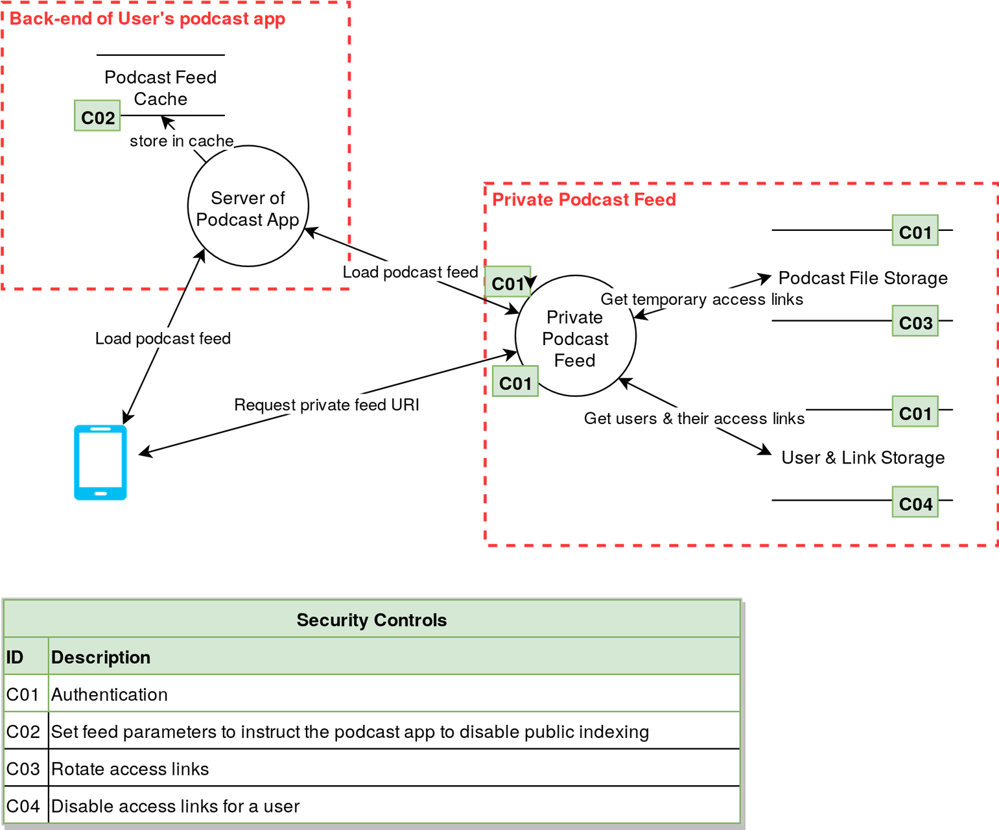

## Installation

* Open draw.io 
* Click the File menu and then click Open Library
  * https://raw.githubusercontent.com/nordineb/drawio-threatmodeling/master/attack-tree.xml
  * https://raw.githubusercontent.com/nordineb/drawio-threatmodeling/master/dfd.xml
* Start diagramming!

Go over each of the assets and data flows, and ask yourself the following STRIDE questions:
* S: Is there a risk for Spoofing? Can someone execute this data flow and pretend they’re someone else? Can I pretend I’m a different employee and view my salary information?
* T: Is there a risk for Tampering? Can I modify the request parameters to get different behavior (and e.g. inject code or modify my salary), or tamper with the files on the server?
* R: Is there a risk for Non-Repudiation? Can someone deny they performed this action? Example: you order something and pay for it, and later request your money back and deny you made the order. Or a super-user could deny having accessed sensitive information such as employee salaries.
* I: Is there a risk for Information Disclosure? Users obtaining more information than they are allowed to? What information could get exposed from this asset, what’s contained in this database?
* D: Stands for Denial-of-service. Some actions could result in DoS, through users spamming actions which require a lot of resources, or result in quota limits being reached on other APIs. An authentication scheme which temporarily locks users out may be abused to deny users (or system accounts … ) being able to log-in.
* E: Is there a risk of Elevation of Privileges? Users obtaining more permissions than they are allowed to? The typical way to circumvent this is to give processes as few permissions as possible, to minimize the attack vector.

[Draw.io]: https://www.draw.io/
[Data Flow Diagramming]: https://en.wikipedia.org/wiki/Data_flow_diagram
[Attack Trees]: https://en.wikipedia.org/wiki/Attack_tree
[Download]: https://about.draw.io/integrations/#integrations_offline

## Data Flow Diagrams

[Data Flow Diagramming] is a simple diagramming technique used to gain an understanding of how data flows in an application or system. DFDs are excellent for getting a bird's-eye view of a system to facilitate threat modeling.

### One example

### Another example

## Attack Trees

[Attack Trees] are another kind of diagramming method that is great for exploring how a threat actor might attain a specific goal, or how an asset might be attacked.

